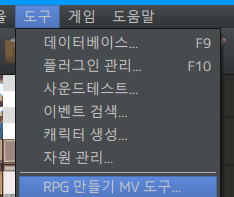
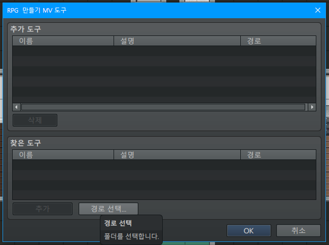
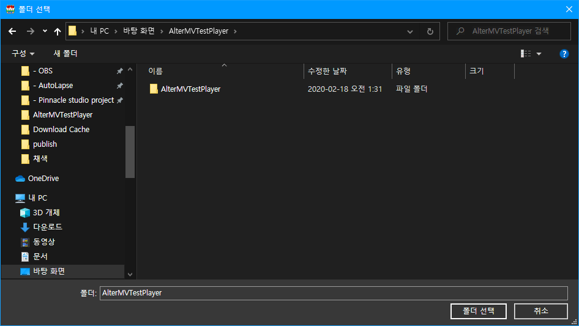
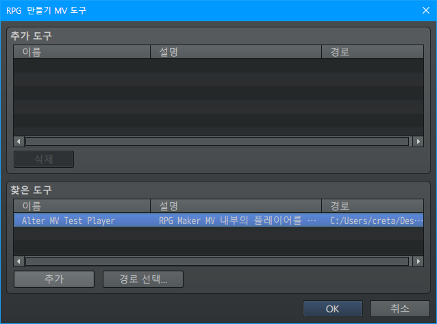
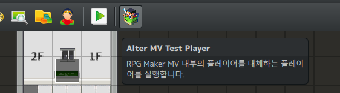

# AlterMVTestPlayer
쯔구르 MV에서 테스트를 할 때 사용할 플레이어를 지정해서 사용할 수 있도록 도와줍니다.

# 설치방법
[Releases](./releases) 탭에서 파일을 다운로드 한 후, 압축을 풀어주세요.  
RPG Maker MV를 실행한 후, 상단의 `도구/RPG 만들기 MV 도구...`를 선택합니다.

하단의 `경로 선택...`을 클릭한 후, 압축을 푼 폴더의 상위 폴더를 선택하세요.

  

찾은 도구에서 `AlterMVTestPlayer`를 선택하고 추가하면, 상단 탭에 새 아이콘이 추가됩니다.  
이 아이콘을 통해 테스트를 진행할 수 있습니다.

  

